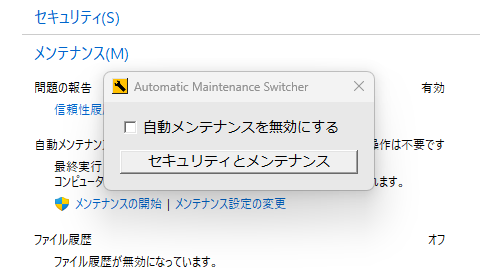
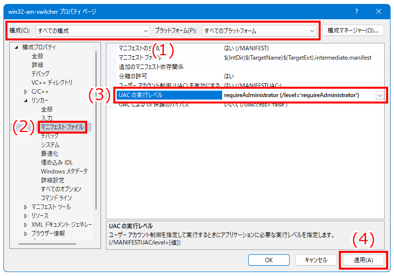

# Automatic Maintenance Switcher

Automatic Maintenance Switcherは、Windows 8以降に搭載された自動メンテナンスの有効・無効を切り替える簡易的なソフトです。

Automatic Maintenance Switcher is simple software, that enables/disables Automatic Maintenance installed in Windows 8 or later.

自動メンテナンスはしばらく操作がないときに自動的に実行されますが、PCにかかる負荷が大きいため、映像キャプチャーや動画エンコードをはじめとした重たい処理の動作を妨げてしまいます。このソフトで無効にしておくことで、自動メンテナンスに阻害されることなくPCの作業が行えます。なお、自動メンテナンスは毎日実行されることを前提にした機能であるため、無効にする前にあらかじめ自動メンテナンスを手動で実行させて、完了したら無効に設定することをお勧めします。

Automatic Maintenance is automatically executed when there is no operation for a while, but because of heavy load on PC, it inhibits with the operation of heavy processing such as video capture and encoding. By disabling it with this software, you can work on your PC without being inhibited by Automatic Maintenance. In addition, since Automatic Maintenance is a function that assumes that it will be executed every day, it is recommended to manually execute Automatic Maintenance in advance before disabling it, and then disable it after completion.

# 使い方（How to use）

本リポジトリのリリースページからインストーラーをダウンロードして実行します。ソフトのインストールおよび実行には管理者権限が必要です。

Download the installer from the releases page of this repository and run it. Administrative privileges are required to install and run the software.

- <https://github.com/sakasagiken/win32-am-switcher/releases>

スタートメニューから「Automatic Maintenance Switcher」（win32-am-switcher.exe）を起動したら、チェックボックスを入れて無効にするだけです。「セキュリティとメンテナンス」を呼び出すボタンも用意してあるため、自動メンテナンスの手動実行もすぐにできます。

After starting "Automatic Maintenance Switcher" (win32-am-switcher.exe) from the start menu, just check the box to disable it. The "Security and Maintenance" button is also installed, so you can quickly run Automatic Maintenance manually.

# 処理内容（How it works）

以下のレジストリキーに指定したレジストリ値を書き込むことで、自動メンテナンスを無効化しています。逆に有効化する場合は、このレジストリ値は削除されます。

Disable Automatic Maintenance by writing the specified registry value to the following registry key. Enable Automatic Maintenance by delete this registry key.

- レジストリキー（Registry key）
    - `HKEY_LOCAL_MACHINE\SOFTWARE\Microsoft\Windows NT\CurrentVersion\Schedule\Maintenance`
- レジストリ値（Registry value）
    - 名前（Name）：`MaintenanceDisabled`
    - 種類（Type）：`REG_DWORD`
    - データ（Data）：`1`

詳細は `wWinMain.cpp` をご覧ください。このソフトのすべての処理が、このソースコードに書かれています。レジストリの値が変更されると即座に反映されるため、サインアウトや再起動は必要ありません。ただし、レジストリのルートキーが `HKEY_LOCAL_MACHINE` であるため、レジストリを変更するには管理者権限が必須です。

See `wWinMain.cpp` for details. All processing of this software is written in this source code. No need to sign out or reboot as registry changes take effect instantly. However, since the root key of the registry is `HKEY_LOCAL_MACHINE`, admin rights are mandatory to modify the registry.

# ビルド方法（How to build）

`win32-am-switcher.sln` を開くとVisual Studioが起動して、そのままビルドできます。

Just open `win32-am-switcher.sln`, Visual Studio will start and it can be built as is.

手動でビルドする際は、`wWinMain.cpp`、`am-switcher-icon.rc`、`am-switcher-icon.ico` をプロジェクトに取り込んでください。ただし、このままだと手動で管理者として実行しない限り、有効・無効の切り替えができないため、プロジェクトのプロパティからマニフェストファイルを編集します。以下の画像の通りに設定することで、管理者権限が必須の実行ファイルが作成されます。

When building manually, include `wWinMain.cpp`, `am-switcher-icon.rc` and `am-switcher-icon.ico` into project. However, in this state, unless you manually run it as an administrator, you can not switch between enabled and disabled, so edit the manifest file from the project properties. By setting as shown in the image below, an executable file that requires administrator privileges will be created.

# 注意事項（Notes）

このプログラムはソースコードが公開されているフリーソフトウェアです。個人情報や金銭の窃取、ならびに悪戯を目的としたプログラムではありませんが、使用中もしくは使用後に何らかの障害や損害が発生しても一切の責任を負いません。

This program is open source software. It is not a program intended for stealing personal information or money, or for mischief, but I do not take any responsibility even if some kind of failure or damage occurs during or after use.
